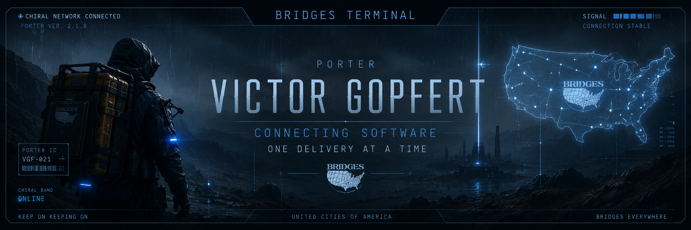
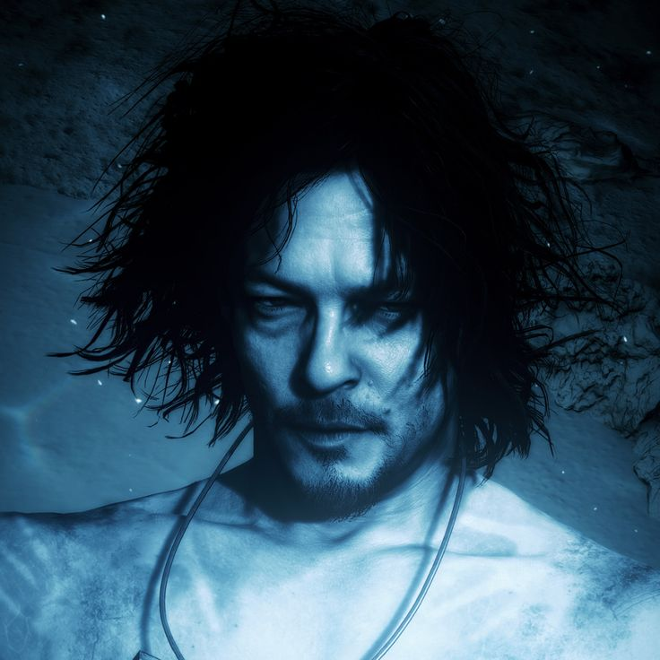
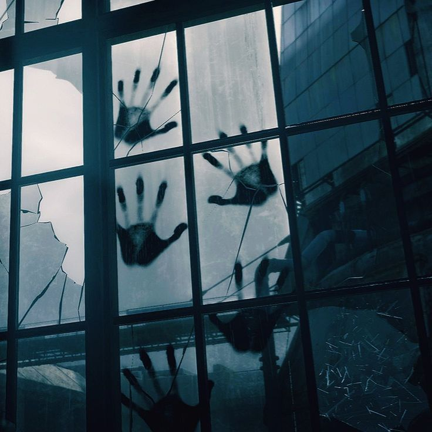
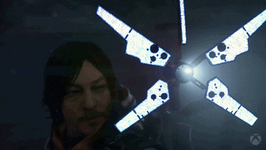

<p align="center">
  
</p>

<h2 align="center">BRIDGES TERMINAL</h2>
<p align="center">
  ⛓ Chiral Network Node // Full Stack Software Engineering
</p>

<p align="center">
  
  
  
</p>

---

## PORTER ID // CHIRAL NETWORK

<table width="100%">
<tr>
<td width="160px" valign="top">
  
  <br><br>
  <sub><b>ODRADEK SCAN</b></sub><br>
  <sub>● NO BTs DETECTED</sub>
</td>
<td valign="top">

```bash
> scanning terrain...
> chiral network detected
> connection established
> porter profile access granted
```

Software Engineer based in Rio de Janeiro, Brazil — delivering code across the network the same way a Porter delivers cargo: with care, precision and zero tolerance for broken connections.

Focused on Full Stack Development, Clean Architecture and Scalable Systems. B.Sc. in Systems Analysis and Development — UERJ.

Every repository is a relay station. Every commit, another step across the chiral network.

> "Keep on keeping on."

</td>
</tr>
</table>

---

## STANDARD LOADOUT

<p align="center"><sub>Equipment cleared by Bridges before deployment</sub></p>

<table width="100%">
<tr>
<td width="160px" valign="top">
  
</td>
<td valign="top">


> Equipment verified. Ready for deployment.

</td>
</tr>
</table>

---

## ACTIVE DELIVERIES

<p align="center"><sub>Cargo currently in transit across the network</sub></p>

<table width="100%">
<tr>
<td width="160px" valign="top">
  
  
</td>
<td valign="top">

**[Authentication API](https://github.com/seu-usuario/seu-repo)** &nbsp; 
Secure authentication built with modern backend architecture.
<br>

**[Full Stack Applications](https://github.com/seu-usuario/seu-repo)** &nbsp; 
Scalable web applications using React, Next.js and NestJS.
<br>

**Personal Studies** &nbsp; 
Exploring software architecture, design patterns and testing.

> Stay sharp. One disconnection can cost the mission.

</td>
</tr>
</table>

---

## CHIRAL NETWORK STATUS

<p align="center"><sub>Synchronization with the network, updated in real time</sub></p>

<table width="100%">
<tr>
<td valign="top">
<br><br>
  
</td>
</tr>
</table>

---

## COMMUNICATION CHANNEL

<p align="center"><sub>Open frequency — feel free to reach out</sub></p>

<table width="100%">
<tr>
<td width="160px" valign="top">
  
</td>
<td valign="top">

<a href="https://www.linkedin.com/in/victor-gopfert-5758292bb/">
  
</a>
<br><br>
<a href="gopfert.web@gmail.com">
  
</a>

> Open for opportunities. Let's build something meaningful.

</td>
</tr>
</table>

---

## FINAL TRANSMISSION

```bash
> delivery log saved
> connection to recruiter terminal stable
> system shutting down...
```

<p align="center"><sub>America is not the only thing we're connecting.</sub></p>
